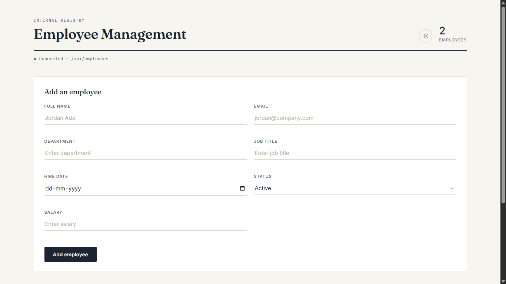
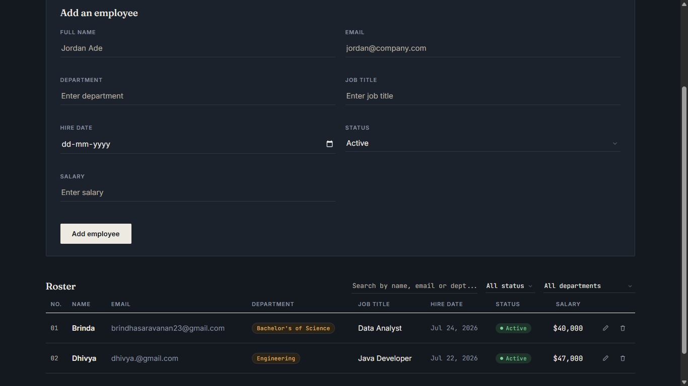
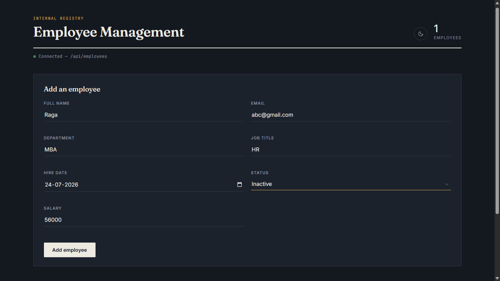

<div align="center">

# Staff Ledger — Employee Management System

A full-stack employee management system with a Spring Boot REST API backend and a vanilla HTML/CSS/JS frontend — no frameworks, no build step, just clean fundamentals.


**[Live Demo](https://employee-management-system-1f1c.onrender.com)**
*(Hosted on Render's free tier — if it's been idle, the first load can take 30–60 seconds to spin back up.)*

</div>

---

## 📋 Overview

Staff Ledger is a CRUD application for managing employee records — names, contact info, department, job title, hire date, employment status, and salary. It's built as a learning/portfolio project to demonstrate a complete, working full-stack flow: a REST API on the backend, and a responsive, dependency-free frontend that consumes it directly.

## 📸 Screenshots

<p align="center">
  
  
</p>
<p align="center">
  
  
</p>

## ✨ Features

**⚙️ Backend (Spring Boot + PostgreSQL)**
- 🔄 Full CRUD REST API (Create, Read, Update, Delete)
- 🏗️ Layered architecture (Controller → Service → Repository)
- 🗄️ JPA/Hibernate entity mapping with auto schema updates
- 🔒 Environment-variable based configuration (no secrets committed to the repo)

**🎨 Frontend (HTML / CSS / JavaScript)**
- ➕ Add, edit, and delete employees with live validation
- 🔍 Search by name, department, or job title
- 🧮 Filter by status (Active / Inactive) and department
- ↕️ Sortable columns (Name, Department, Job Title, Hire Date, Salary)
- 📄 Pagination for large employee lists
- 🌗 Light / Dark mode toggle with saved preference
- 🔔 Toast notifications and a custom confirmation modal (no native browser alerts)
- 📱 Fully responsive layout

## 🛠️ Tech Stack

| Layer          | Technology                          |
|----------------|--------------------------------------|
| Backend        | Java, Spring Boot, Spring Data JPA   |
| Database       | PostgreSQL                           |
| Frontend       | HTML5, CSS3, Vanilla JavaScript (ES6+) |
| Build Tool     | Maven                                |

## 📁 Project Structure

```
employee-management-system/
├── src/
│   ├── main/
│   │   ├── java/com/example/employeeapi/
│   │   │   ├── Employee.java              # Entity
│   │   │   ├── EmployeeRepository.java    # Data access layer
│   │   │   ├── EmployeeService.java       # Business logic
│   │   │   ├── EmployeeController.java    # REST endpoints
│   │   │   └── EmployeeapiApplication.java
│   │   └── resources/
│   │       ├── application.properties     # Config (reads from env vars)
│   │       └── static/                    # Frontend
│   │           ├── index.html
│   │           ├── style.css
│   │           └── script.js
│   └── test/
├── pom.xml
└── README.md
```

## 🔌 API Endpoints

| Method | Endpoint              | Description              |
|--------|------------------------|---------------------------|
| GET    | `/api/employees`       | Get all employees         |
| GET    | `/api/employees/{id}`  | Get a single employee     |
| POST   | `/api/employees`       | Create a new employee     |
| PUT    | `/api/employees/{id}`  | Update an existing employee |
| DELETE | `/api/employees/{id}`  | Delete an employee        |

**Example employee object:**
```json
{
  "id": 1,
  "name": "Jordan Ade",
  "email": "jordan@company.com",
  "department": "Engineering",
  "jobTitle": "Software Engineer",
  "hireDate": "2024-03-15",
  "status": "ACTIVE",
  "salary": 65000
}
```

## 🚀 Getting Started

### ✅ Prerequisites
- Java 17 or later
- Maven (or use the included `./mvnw` wrapper)
- PostgreSQL running locally (or a connection string to a hosted instance)

### 1️⃣ Clone the repository
```bash
git clone https://github.com/Nobaraaa/Employee-Management-System.git
cd Employee-Management-System
```

### 2️⃣ Create the database
```sql
CREATE DATABASE employee_db;
```

### 3️⃣ Configure your credentials
The app reads database credentials from environment variables — nothing is hardcoded in the repo. Set these before running:

```bash
export DB_URL=jdbc:postgresql://localhost:5432/employee_db
export DB_USERNAME=postgres
export DB_PASSWORD=your_password_here
```

On Windows (PowerShell):
```powershell
$env:DB_URL="jdbc:postgresql://localhost:5432/employee_db"
$env:DB_USERNAME="postgres"
$env:DB_PASSWORD="your_password_here"
```

If these aren't set, the app falls back to `localhost:5432/employee_db` with username `postgres` and a blank password.

### 4️⃣ Run the application
```bash
./mvnw spring-boot:run
```

### 5️⃣ Open it
Visit **http://localhost:8080** — the frontend is served directly by Spring Boot, so the API and UI run on the same origin with no CORS setup required.

## ☁️ Deployment

This project is set up to deploy for free using:
- **[Neon](https://neon.tech)** — free, persistent PostgreSQL hosting
- **[Render](https://render.com)** — free web service hosting for the Spring Boot app

Build command: `./mvnw clean package -DskipTests`
Start command: `java -jar target/employeeapi-0.0.1-SNAPSHOT.jar`

Set `DB_URL`, `DB_USERNAME`, and `DB_PASSWORD` as environment variables in your hosting dashboard — never in the codebase.

## 🗺️ Roadmap

- [ ] 🔐 Authentication and role-based access
- [ ] 📤 Bulk import/export (CSV)
- [ ] 🖼️ Employee profile photos
- [ ] 🕵️ Audit log for record changes

## 📄 License

This project is licensed under the MIT License — feel free to use it as a reference or starting point for your own work.

## 👤 Author

**Nobaraaa**
GitHub: [@Nobaraaa](https://github.com/Nobaraaa)
